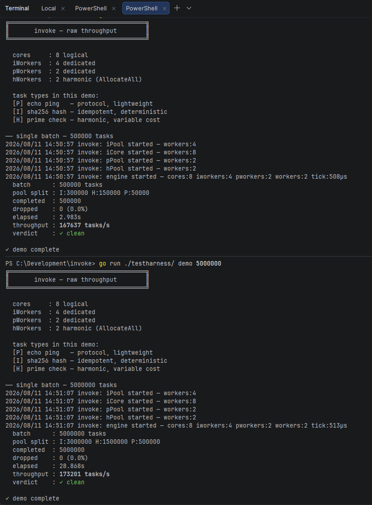

# Invoke

A structured concurrency engine for Go. Invoke partitions work across three semantically distinct worker pools, routes tasks through a type-sealed command interface, and schedules priority work via a two-axis float coordinate system — all without dynamic allocation on the hot path.

→ [Quick Start](#quick-start)

---

## Install

    go get github.com/TavariAgent/invoke-golang

---

## Throughput

Benchmarked on AMD Ryzen 7800 (8 logical cores, 4 iPool + 2 pPool + 2 hPool workers):

| Workload                                                  | Tasks/s    |
|-----------------------------------------------------------|------------|
| Minimum difficulty (string ops, lightweight hashing)      | ~6,000,000 |
| Average work rate (100-round SHA256 + large prime checks) | ~150,000   |

Throughput is linear at volume. Scaling from 500,000 to 5,000,000 tasks produces a proportional elapsed increase with no scheduling overhead accumulation — the engine's coordination cost does not compound.

The ceiling is worker-bound, not scheduler-bound. The engine does not become the bottleneck.

---

## Architecture

### Three pools

Invoke separates work into three pools at submission time, not at runtime. Each pool makes assumptions about its workload that reduce synchronization cost. All pools share the same structural primitives — mutex, condition variable, unbounded queue, stop channel, and drop counter — and follow the same operational discipline. What differs is the scheduling strategy each pool applies to its queue.

```
iPool — idempotent work
    Deterministic, repeatable. Safe to re-run on failure.
    FIFO queue. Multiple dedicated workers.
    Examples: hashing, signature validation, salt generation.

rPool — command receipt (iCore technicality)
    Not a standalone pool. The iPool splits off a second internal queue
    (rQueue) drained by dedicated iCore workers — one per logical core
    by default (runtime.NumCPU()). This lane handles command receipt
    exclusively: parsing incoming command strings, resolving registrations,
    and dispatching to the correct pool. iCore workers share the iPool stop
    channel but hold no lock shared with standard iPool workers. The split
    means command traffic cannot starve general idempotent work and general
    work cannot delay command receipt. From the outside it presents as
    AssignR on the factory — internally it is the iPool's second lane.

pPool — protocol work
    IO-bound. Spends most of its time blocked on syscalls.
    Isolated so network latency cannot starve CPU-bound pools.
    Examples: TCP handshakes, DNS resolution, connection management.

hPool — harmonic work
    Variable elapsed time, static difficulty class.
    Priority-scheduled via min-heap. Workers pull the lowest-coordinate
    task next. Lower Group number = earlier phase; lower Order = earlier
    within that phase.
    Examples: prime checks, recursive computation, variable-depth search.
```

The separation is not organizational. A pPool task that blocks on a network call does not hold a worker that an iPool task needs. Each pool is an independent queue with independent workers and an independent condition variable.

### Unbounded queues

All three pools use unbounded queues. There is no backpressure, no blocking submitter, no reject-on-full. Submission pace is set entirely by the caller. Worker drain pace is set entirely by hardware. The queue is never the bottleneck.

---

## Pools

### Why do they exist?

The pools are an entropy patch to the CPU's processing space. A single goroutine pool running mixed work creates invisible contention: IO-bound tasks hold workers while they block, CPU-bound tasks queue behind them, and the scheduler has no information to make better decisions. Throughput degrades non-linearly as the mix varies.

Separating work by category gives each pool a homogeneous queue. Workers in the iPool always find CPU work ready. Workers in the pPool are expected to block — that is their job. The hPool's heap ensures that when a worker is free, it picks the lowest-coordinate task available rather than the next in arrival order. Each pool optimises for its own workload without interfering with the others.

### Can there be more?

Yes. The pool pattern is not closed. Adding a new pool type manually requires three things: a task struct with a `run()` method, a pool struct with a mutex, condition variable, queue, stop channel, and drop counter, and a corresponding `Assign` method on the factory. The existing pools are the canonical implementations — a new pool follows the same structure. There is no registration system to update; pools are wired directly into the engine and factory at construction.

### What are the limits?

Not many. The practical constraints are:

Workers are goroutines — Go's scheduler handles thousands without issue. The per-pool worker count is configurable and can be tuned against measured throughput via `CalibrateIdempotent`. There is no enforced ceiling.

Queues are unbounded slices — they grow with submission rate. If producers consistently outpace workers the queue will grow. This is by design: the engine does not shed load silently. Tasks that enter the queue will run. Monitor drop counters for rejected tasks rather than queue depth for backpressure signals.

The hPool heap is O(log n) on push and pop — at very high queue depths under sustained load this cost becomes measurable. In practice the heap drains faster than it fills on hardware with adequate worker count.

---

## Observations

Throughput is sub-linearly bound to task volume — the engine becomes
marginally more efficient as batch size increases. At 500,000 tasks
the measured rate is ~167K/s; at 5,000,000 tasks it rises to ~173K/s.
Workers stay continuously fed as queue depth increases, eliminating
the idle gaps that cap smaller batches.

- `Call` has no timeout — if a task is submitted successfully but never
  completes, the caller blocks indefinitely. Context propagation is
  planned.
- Command args are `map[string]string` — all input arrives as strings.
  Callers handle their own type conversion. Arg-level type enforcement
  is not yet part of the registry.
- The HTTP interface reads args from query params (GET) or a flat JSON
  object (POST). Nested structures in args are not supported.

---

## Priority System

The hPool scheduler uses a two-axis coordinate: `Group` (integer) and `Order` (float64). Both axes sort ascending — lower values run first. Group establishes the phase; Order establishes the channel within that phase.

```go
type Priority struct {
    Group int     // lower group runs first — phased execution
    Order float64 // position within the group — lower runs first
}
```

**Group** partitions work into execution phases. All tasks in Group 1 are exhausted before any Group 2 task reaches a worker. Groups can represent pipeline stages, urgency tiers, or dependency phases.

**Order** subdivides each group into a continuous sequence of fractional channels. A float64 provides approximately 2⁵³ distinct positions between any two integers. Tasks can be inserted between any two existing positions without renumbering — the sequence is infinitely subdivisible.

Floats work unilaterally — any valid float64 is a legal Order value. Ascending, descending, arbitrary spacing, and mid-sequence insertion are all equivalent operations to the heap:

```go
// ascending sequence — tasks run A → B → C within Group 1
factory.AssignH(invoke.Priority{Group: 1, Order: 0.1}, fnA)
factory.AssignH(invoke.Priority{Group: 1, Order: 0.2}, fnB)
factory.AssignH(invoke.Priority{Group: 1, Order: 0.3}, fnC)

// insert between existing positions — no renumbering needed
factory.AssignH(invoke.Priority{Group: 1, Order: 0.15}, fnX) // runs after A, before B

// Group 2 begins only after all Group 1 tasks are exhausted
factory.AssignH(invoke.Priority{Group: 2, Order: 1.0}, fnD)
factory.AssignH(invoke.Priority{Group: 2, Order: 2.0}, fnE)
factory.AssignH(invoke.Priority{Group: 2, Order: 1.5}, fnF) // inserts between D and E

// zero Order — valid, runs at the front of its group
factory.AssignH(invoke.Priority{Group: 3, Order: 0.0}, fnG)
```

Ordering is a property declared at submission time, not computed under contention. The heap sorts what it receives. There is no runtime coordination problem because the sequence was established before the task entered the system.

At 10 billion concurrent tasks, Group/Order coordinates remain precise. The float coordinate space does not saturate.

### Parity condition

Two tasks with identical `Group` and `Order` are indistinguishable to the heap. The heap cannot manufacture an ordering between them — execution order is undefined and governed by whichever worker happens to pop next under concurrent drain.

```go
// all three land at Group:0 Order:0.0 — immediate parity condition
factory.AssignH(invoke.Priority{}, fnA)
factory.AssignH(invoke.Priority{}, fnB)
factory.AssignH(invoke.Priority{}, fnC)
```

The heap sees three equal entries. It pops them in whatever order its internal state produces under concurrent push — fnA, fnB, fnC may complete as fnB, fnA, fnC or any permutation. Any pipeline assumption built on their sequence silently breaks.

The fix is always the same: assign distinct Order values to tasks that must run in a defined sequence, even if they share a Group.

```go
factory.AssignH(invoke.Priority{Group: 1, Order: 0.1}, fnA)
factory.AssignH(invoke.Priority{Group: 1, Order: 0.2}, fnB)
factory.AssignH(invoke.Priority{Group: 1, Order: 0.3}, fnC)
```

A secondary risk applies when re-submitting to hPool from inside an hPool command handler and blocking on the result. The calling goroutine holds a worker slot while waiting for a child task that needs its own slot. If all workers are occupied with parents doing the same, no child can be scheduled — deadlock. Route sub-work to iPool or pPool where possible, or run it inline in the current goroutine rather than re-submitting.

---

## Typed Command Interface

Invoke exposes a string-keyed command dispatch layer with two-way type enforcement. Commands are registered at startup with a declared return type `T`. The type is captured via reflection at registration and sealed before the server accepts requests. No type can be introduced or modified after seal.

`T` is the trust boundary. It is declared inside the method signature — not inferred from the first result at runtime, not supplied by the caller over the network. The method signature is where `T` lives and where it is locked. Once registered, `T` becomes `R` — the known type the system expects to receive back from that command. The separation happens at the edge of the method signature: the developer writes `(PrimeResult, error)`, the engine reads `PrimeResult` as `R` at registration time, and every result produced by that command is checked against `R` before it crosses any boundary. The caller never touches `T` directly. The network never sees an unnarrowed value.

```go
table := invoke.NewCommandTable(engine, factory)

// T = PrimeResult — declared in the method signature, captured once
// R = PrimeResult — the known type the engine checks all results against
invoke.Register[PrimeResult](table, "prime",
    invoke.Priority{Group: 2},
    func(args map[string]string) (PrimeResult, error) { // T lives here
        n, _ := strconv.Atoi(args["n"])
        return PrimeResult{N: n, IsPrime: isPrime(n)}, nil
    },
)

table.Seal()  // vault closed — no registration possible after this line
              // R is now immutable for every registered command
```

`finalize` runs on every result before it crosses the network boundary. The result must prove itself as `R` — the type locked at registration. A type mismatch destroys the result at the exit gate. The caller receives an error. Nothing unnarrowed escapes the engine.

This eliminates a class of attack against networked threading interfaces: a caller cannot coerce the system into producing a compound type that embeds an unexpected payload, because `R` is package-path qualified — structural matches from external packages are rejected by identity, not by field comparison. The method signature wrote the rule. The seal made it permanent.

```go
// wire the table to HTTP
mux := http.NewServeMux()
table.ServeHTTP(mux)
http.ListenAndServe(":29871", mux)
```

```
curl http://localhost:29871/command/prime?n=999983
# {"command":"prime","result":{"n":999983,"is_prime":true,"elapsed":"1.2ms"}}

curl http://localhost:29871/commands
# {"commands":["prime","hash","ping","fib"]}
```

---

## Config Reference

```go
invoke.Config{
    IWorkers:     4,              // dedicated iPool workers
    ICoreWorkers: 8,              // iCore receipt lane workers (default: NumCPU)
    PWorkers:     2,              // dedicated pPool workers
    Allocate:     AllocateAll,    // remaining cores → hPool (AllocateSome leaves headroom)
    HeadroomN:    2,              // cores reserved when using AllocateSome
    LogEvents:    LogDropped | LogLifecycle | LogCalibrate,
    NotifyDrops:  true,           // print drop log path to terminal
    LogDir:       "./invoke-logs",// drop log directory (default: ./invoke-logs)
}
```

---

## FracTimer

The engine exposes a calibrated fractional timer at `engine.Timer`. On startup, it measures the real OS tick size by spinning until the system clock advances — no assumed value. It then distributes completion timestamps across tick boundaries using sequence position as a proportional fraction of that measured tick.

The unit produced is approximated nanoseconds: real elapsed time in microseconds converted to nanoseconds, plus a synthetic fractional offset derived from sequence position and tick size. The offset is strictly metric — it scales proportionally to the measured OS resolution rather than a fixed constant. On Windows (tick ~15ms), tasks completing within a single tick receive readable ordered timestamps rather than uniform zeros. On Linux (tick ~1ms or lower), the fractional offset becomes negligible and real elapsed time dominates.

```go
engine.Timer.ReadUs()   // approximated nanoseconds — real elapsed + fractional offset
engine.Timer.Reset()    // reset origin and sequence counter
engine.Timer.TickUs()   // measured OS tick size in microseconds — logged at Start()
```

The tick size is emitted in the startup log:

```
invoke: engine started — cores:8 iworkers:4 pworkers:2 workers:2 tick:15µs
```

---

## Drop Logging

Tasks rejected by the engine — nil function, engine not running, invalid priority — are counted per pool and flushed to a timestamped log file every two seconds. The terminal remains silent by default (`NotifyDrops: false`). Each pool's drop counter is an `atomic.Int64` swapped on flush, adding no contention to the task path.

```
invoke-logs/drops-2026-08-11-175423.log
  invoke drop log — 2026-08-11T17:54:23Z
  total dropped: 3
  ────────────────────────────────────────────────
  0001  iPool dropped 2 tasks
  0002  iCore dropped 1 commands
```

---

## Calibration

```go
rec := engine.CalibrateIdempotent(50_000, 2*time.Second)
fmt.Printf("throughput  : %d tasks/s\n", rec.Throughput)
fmt.Printf("min workers : %d\n", rec.MinWorkers)
fmt.Printf("max workers : %d\n", rec.MaxWorkers)
```

Calibration runs a measured batch through the iPool and returns recommended worker bounds for the host hardware and workload. Use it to tune `IWorkers` before committing to a config.

---

## Test Harness

The `testharness/` package covers four run modes. All share the same engine config and factory.

```
go run ./testharness/                — calibrate + protocol + idempotent + harmonic + dictionary race
go run ./testharness/ demo           — raw throughput across all three pools, 10,000 tasks default
go run ./testharness/ demo 50000     — custom batch size
go run ./testharness/ demo ramp      — escalating batch sizes until ceiling found
go run ./testharness/ serve          — HTTP command server on :29871
go run ./testharness/ drops          — drops batcher demo + scatter routing + parity test on :29872
```

**Default harness** runs a calibration pass, a real TCP echo handshake through pPool, eight HMAC-SHA256 signatures and a hash composer through iPool, four Fibonacci computations (fib(35)–fib(38)) through hPool, and a dictionary prefix-search race simulating keypress latency against iPool throughput.

**Demo mode** builds a mixed batch — SHA256 hashing (iPool, ~60%), prime checks (hPool, ~30%), DNS lookups (pPool, ~10%) — and measures raw throughput. Ramp mode escalates batch size until the drop rate signals a ceiling.

**Serve mode** registers four typed commands — `hash`, `prime`, `fib`, `ping` — over HTTP. The `/test/ordering` endpoint fires 20 heavy primes at Group 2 and 5 lightweight pings at Group 1 concurrently, confirming that Group 1 pings surface before Group 2 primes regardless of submission order.

**Drops mode** demonstrates three things in sequence. First, typed matrix commands returning both JSON and CSV from the same computation, grouped by priority phase — Group 1 (squared) drains before Group 3 (transposed) begins. Second, the scatter pattern: a single command handler running in an hPool goroutine that routes sub-work explicitly to iPool (SHA-256 hash), pPool (simulated IO wait), and runs the remaining computation inline rather than re-submitting to hPool. Third, the parity condition live: Group 1 tasks with distinct Orders complete in deterministic ascending sequence; Group 3 tasks sharing `Order: 0.0` complete in undefined order regardless of submission index.

---

## Quick Start

```go
engine := invoke.NewEngine(invoke.Config{
IWorkers: 4,  // These should be along the same lines as total cores per-system
PWorkers: 2,  // Leave a couple open for hPool
Allocate: invoke.AllocateAll,  // remaining cores go to hPool
})
engine.Start()
defer engine.Stop()

factory := invoke.NewFactory(engine)

// idempotent — deterministic, repeatable
factory.AssignI(func() {
h := sha256.Sum256([]byte("input"))
_ = hex.EncodeToString(h[:])
})

// protocol — IO-bound, isolated from CPU pools
factory.AssignP(func() {
_, _ = net.LookupHost("localhost")
})

// harmonic — priority scheduled, Group 1 runs before Group 3
factory.AssignH(invoke.Priority{Group: 1, Order: 0.1}, fnHighPriority)
factory.AssignH(invoke.Priority{Group: 3, Order: 0.5}, fnLowPriority)
// Order subdivides within a group — lower Order runs first
factory.AssignH(invoke.Priority{Group: 1, Order: 0.25}, fnMidPriority)
factory.AssignH(invoke.Priority{Group: 1, Order: 0.125}, fnBetween)

// typed HTTP command interface
table := invoke.NewCommandTable(engine, factory)
invoke.Register[MyResult](table, "my-command",
invoke.Priority{Group: 2},
func(args map[string]string) (MyResult, error) {
return MyResult{Value: args["input"]}, nil
},
)
table.Seal()

mux := http.NewServeMux()
table.ServeHTTP(mux)
http.ListenAndServe(":29871", mux)
```

---

## Performance



> *Task runs from a Ryzen 7800*

---

**Requires Go 1.22+**

> Note: This is an early development build, rough edges are expected. I plan to make this a secure dynamic threading interface and model for both web-based and local use.

---
## License

MIT